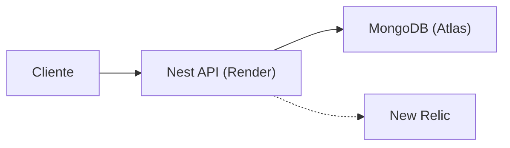

# Arquitetura

## Fluxo de request



Em produção a API roda no Render, os documentos no Atlas, o APM no New Relic.

## Camadas

```text
controller  →  service  →  repository (interface)  →  mongoose
     │                                                    │
    DTO                                              document
                         entities (domínio)
```

## Estrutura de arquivos

```text
src/
  main.ts                 Helmet, CORS, ValidationPipe, Swagger
  app.module.ts           guards globais (JWT, throttler)
  database/               conexão banco de dados
  modules/
    auth/                 JwtModule, AuthGuard, @Public()
    health/               GET /api-status — ping no Mongo
    profile/
      controllers/        HTTP
      services/           orquestração
      dtos/               contrato de escrita (class-validator)
      entities/           domínio
      repositories/
        *.interface.ts    porta
        mongoose/         schema, mapper, implementação
```

## Auth

O `AuthGuard` é global. Sem token, a rota falha com 401 — salvo se estiver marcada com `@Public()`.

| Rota              | Auth       |
| ----------------- | ---------- |
| `GET /profile`    | público    |
| `GET /api-status` | público    |
| `POST /profile`   | JWT Bearer |

Leitura pública, escrita autenticada.

## Versionamento

Cada `POST /profile` incrementa um contador por `profileId` e **insere** um documento novo. Nada é sobrescrito.

O `GET /profile` devolve só a última versão. O número vem no payload (`version`).

## Superfície HTTP

| Método | Path          | Papel                                                                                                   |
| ------ | ------------- | ------------------------------------------------------------------------------------------------------- |
| `GET`  | `/profile`    | GET do currículo vigente. Aceita parâremtro `profileId` para definir o perfil. (valr padrão: `default`) |
| `POST` | `/profile`    | Nova versão do currículo, com o nome de `profileId` recebido no corpo                                   |
| `GET`  | `/api-status` | Health da API **e** do Mongo.                                                                           |

CORS aceita só origens em `CORS_ORIGINS`. Throttler global (10 req/min) e POST (5/min).
