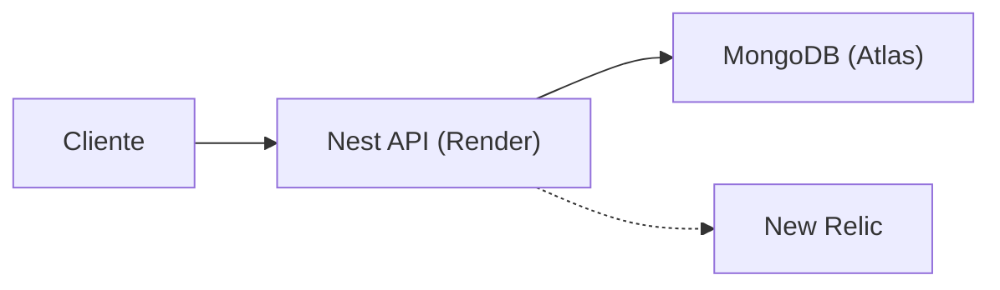
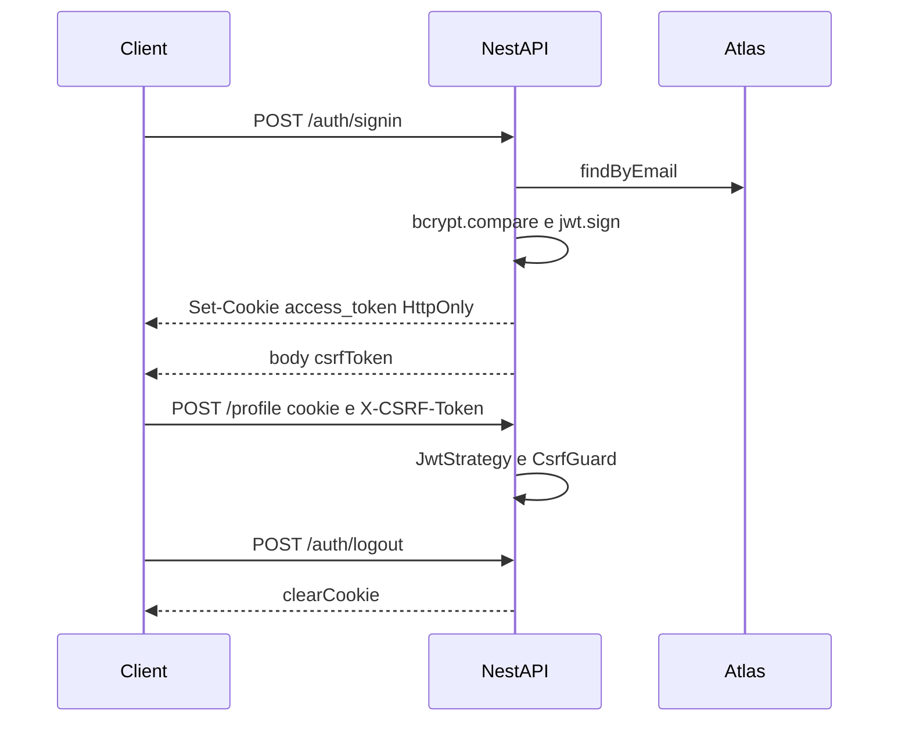

# Arquitetura

## Fluxo de request



## Auth cookie + CSRF



## Camadas

```text
controller  →  service  →  repository (interface)  →  mongoose
     │                                                    │
    DTO                                              document
                         entities (domínio)
```

## Estrutura de arquivos

```text
src/
  main.ts                 Helmet, CORS, CSRF, cookie-parser, ValidationPipe, Swagger
  app.module.ts           guards globais (JWT cookie, throttler)
  database/               conexão banco de dados
  modules/
    auth/
      controllers/        rotas de auth
      services/           serviços do alth
      dtos/               dtos dos POSTs
      entities/           Entidades de domino do auth
      repositories/       Queries de auth
      strategies/         Estrategias passport
    health/               GET /api-status — ping no Mongo
    profile/
      controllers/        HTTP
      services/           orquestração
      dtos/               contrato de escrita (class-validator)
      entities/           domínio
      repositories/
        *.interface.ts    porta
        mongoose/         schema, mapper, implementação
  utils/
    env.ts               parser de variáveis de ambiente
    auth-cookie.ts       utilitários de autenticação
```

## Auth

O `AuthGuard` (Passport JWT) é global. O token fica no cookie HttpOnly `access_token` — salvo rotas com `@Public()`. Mutações autenticadas também passam pelo CSRF, que exige cookie HttpOnly e o csrfToken retornado no login.

| Rota                | Auth                                                      |
| ------------------- | --------------------------------------------------------- |
| `GET /profile`      | público                                                   |
| `GET /api-status`   | público                                                   |
| `POST /auth/signin` | público; seta cookie JWT e CSRF e devolve csrfToken       |
| `POST /auth/logout` | público; remove cookies                                   |
| `POST /profile`     | cookie `access_token` e `CSRF` + `x-csrf-token` no header |

Leitura pública, escrita autenticada.

## Versionamento

Cada `POST /profile` incrementa um contador por `profileId` e **insere** um documento novo. Nada é sobrescrito.

O `GET /profile` devolve só a última versão. O número vem no payload (`version`).

## Superfície HTTP

| Método | Path           | Papel                                                                                                   |
| ------ | -------------- | ------------------------------------------------------------------------------------------------------- |
| `POST` | `/auth/signin` | Login com `email` e `password`. Seta o cookie HttpOnly e devolve `csrfToken`.                           |
| `POST` | `/auth/logout` | Remove o cookie JWT e o cookie CSRF.                                                                    |
| `GET`  | `/profile`     | GET do currículo vigente. Aceita parâmetro `profileId` para definir o perfil. (valor padrão: `default`) |
| `POST` | `/profile`     | Rota protegida para criar nova versão do currículo, com o nome de `profileId` recebido no corpo         |
| `GET`  | `/api-status`  | Health da API **e** do Mongo.                                                                           |

CORS aceita só origens em `CORS_ORIGINS`, com `credentials`. Throttler global (10 req/min) e POSTs de escrita (5/min).
