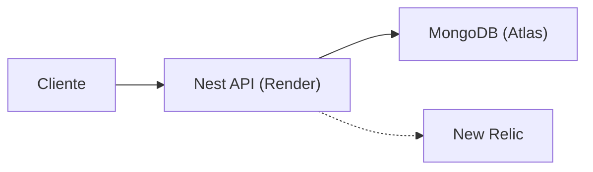
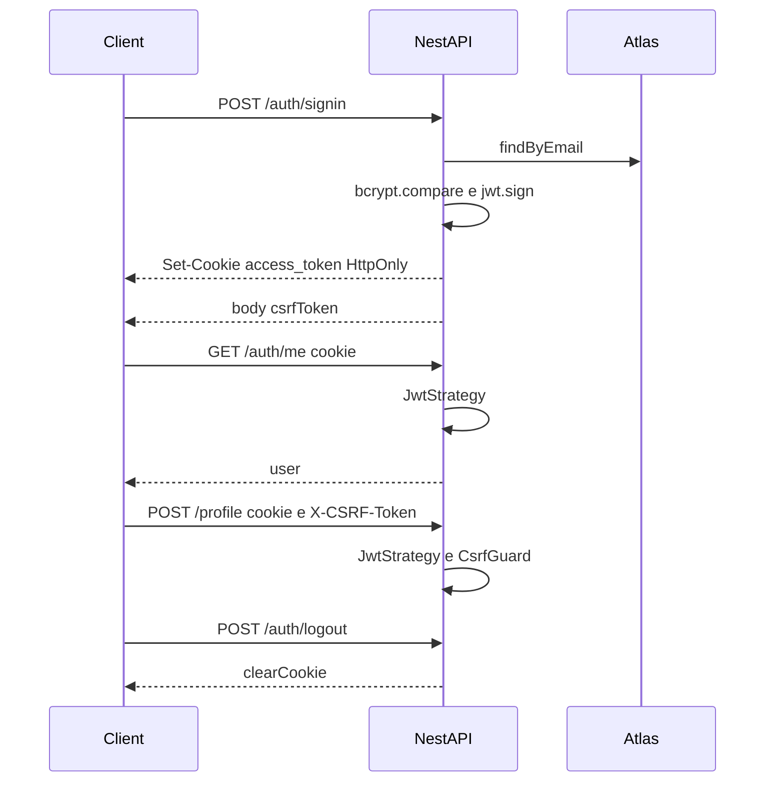

# Arquitetura

## Fluxo de request



## Auth cookie + CSRF



## Camadas

```text
controller  →  service  →  repository (interface)  →  mongoose
     │                                                    │
    DTO                                              document
                         entities (domínio)
```

## Estrutura de arquivos

```text
src/
  main.ts                 Helmet, CORS, CSRF, cookie-parser, ValidationPipe, Swagger
  app.module.ts           Guards globais (JWT cookie, throttler)
  database/               Conexão banco de dados
  utils/                  Utilitários globais da aplicação
  modules/
    auth/
      controllers/        Rotas
      services/           Serviços
      dtos/               Contrato de escrita (class-validator)
      entities/           Entidades de domino
      repositories/       Queries com banco
      strategies/         Estrategias passport
    health/               GET /api-status — ping no Mongo
    profile/
      controllers/        Criar e recuperar dados do perfil
      services/           Serviços do perfil
      dtos/               Contrato de escrita (class-validator)
      entities/           Entidades de domino
      repositories/       Queries com banco
```

## Auth

O `AuthGuard` (Passport JWT) é global. O token fica no cookie HttpOnly `access_token` — salvo rotas com `@Public()`. Mutações autenticadas também passam pelo CSRF, que exige cookie HttpOnly e o csrfToken retornado no login. Leitura pública, escrita autenticada.

## Versionamento

Cada `POST /profile` incrementa um contador por `profileId` e **insere** um documento novo. Nada é sobrescrito.

O `GET /profile` devolve só a última versão. O número vem no payload (`version`).

## Rotas

| Método | Path           | Auth      | Papel                                                                                                      |
| ------ | -------------- | --------- | ---------------------------------------------------------------------------------------------------------- |
| `POST` | `/auth/signin` | pública   | Login com `email` e `password`. Seta o cookie HttpOnly e devolve `csrfToken`.                              |
| `GET`  | `/auth/me`     | protegida | Devolve o `user` da sessão.                                                                                |
| `POST` | `/auth/logout` | protegida | Remove o cookie JWT e o cookie CSRF.                                                                       |
| `GET`  | `/profile`     | pública   | Retorna o currículo vigente. Aceita parâmetro `profileId` para definir o perfil. (valor padrão: `default`) |
| `POST` | `/profile`     | protegida | Cria nova versão do currículo, com o nome de `profileId` recebido no corpo                                 |
| `GET`  | `/api-status`  | pública   | Retorna o status da API e do Mongo.                                                                        |

CORS aceita só origens em `CORS_ORIGINS`, com `credentials`. Throttler global (10 req/min) e POSTs de escrita (5/min).
